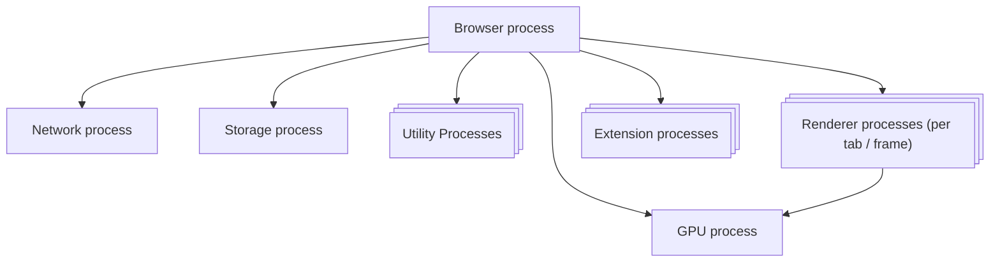
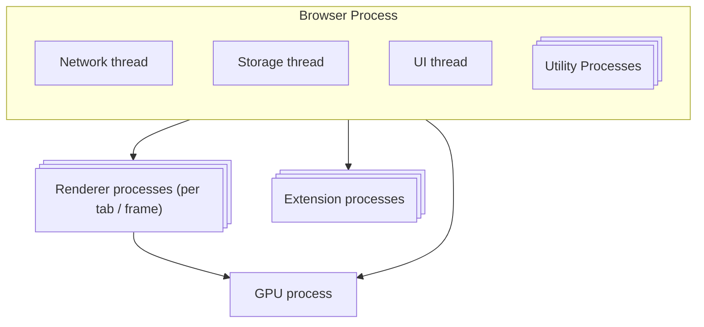

Modern web browsers feel simple on the surface—type a URL, hit enter, and a page appears. But under that smooth experience sits a complex set of systems working in parallel and coordinated with care. When I dug deeper into Chrome’s process model, I realized how much of the web’s behavior only makes sense once you understand how the browser itself is built.

## Multi-Process Architecture

Chrome is a multi-process software. It separates concerns with processes. Each process can then run multiple threads in parallel.

| Process       | What it controls                                                                                                       |
|--------------|------------------------------------------------------------------------------------------------------------------------|
| **Browser**  | Coordinates other processes, owns the UI (address bar, tabs, back/forward) and the main network and file privileges. |
| **Network**  | Handles the network stack: DNS, TCP/TLS, HTTP, and resource fetching, independently from the UI.                      |
| **Storage**  | Manages storage operations: cache, cookies, local storage, IndexedDB, and other on-disk data.                         |
| **GPU**      | Performs GPU-accelerated compositing and graphics work, isolated from other processes.                                |
| **Utility**  | Runs auxiliary services like audio playback, image decoding, and other offloaded tasks.                               |
| **Renderer** | One renderer process per tab or cross-site frame running Blink and V8: parses HTML/CSS, executes JavaScript, manages DOM, layout, and painting. |
| **Extension**| One or more processes per Chrome extension, running in isolation from websites and other extensions.                  |

It brings 3 benefits:

- **Resilience**: If one process crashes (for example, a renderer for a single tab), only that part of the browser is affected and the rest keeps running. A broken site usually means you can just close or reload that tab instead of restarting the whole browser.
- **Performance**: Processes are independent and can run in parallel on multiple CPU cores. Heavy work in one tab (like a WebGL app or a big JavaScript bundle) is less likely to freeze other tabs or the browser UI.
- **Isolation / Security**: Each process runs in its own sandbox with restricted access to system APIs and other processes' memory. Combined with Site Isolation, this means different sites and extensions are kept separate, limiting the blast radius of bugs and vulnerabilities.

## Servicification

Chrome has started "Servicification", turning some components into services that can run either in their own dedicated process or inside a single process on separate threads. On memory-constrained devices, Chrome can run services like network, storage, and utility in the browser process in their own threads to reduce resource usage.

## Site Isolation: Per-Frame Renderer Processes

Site Isolation is a Chrome security feature that ensures cross-site iframes run in their own renderer processes instead of sharing one process across different sites. This pushes the Same Origin Policy down to the process level: each origin (and many cross-site frames) gets its own memory space. By separating sites into different processes, Chrome significantly reduces the impact of side‑channel attacks like Spectre—a compromised renderer for one origin cannot directly read another site's memory.

## How Chrome handles user interactions

Because each part of Chrome runs in its own process, they have to talk to each other using **inter‑process communication (IPC)** instead of direct function calls. The **browser process** sits in the middle and routes most messages between processes.

### From address bar to page load

1. You type a URL in the address bar and press Enter. The address bar (omnibox) lives in the **browser process**.  
2. The browser process decides whether this is a search or a navigation, then starts a navigation for the chosen URL.  
3. It asks the **network process** to resolve DNS and open the TCP/TLS connection, then to fetch the main document
4. Once headers are received and the target site is known, the browser process selects or creates the right **renderer process** for that origin (and Site Isolation rules).  
5. The browser process sends the response as a raw byte stream to that renderer over IPC. The renderer parses HTML/CSS, runs JavaScript, and then starts requesting sub-resources (images, CSS, JS) via further IPC calls back to the browser and network processes. (More detail in [Browser DNS behavior](/posts/browser-dns-behavior).)

### From user input to event handlers

1. Mouse, keyboard, and touch events first arrive in the **browser process** from the operating system.  
2. At this stage the browser process only has the coordinates. It process [hit-tests](https://www.w3.org/wiki/Hit_Testing) which tab and which region should receive the event, then forwards it to the correct **renderer process**.  
3. Inside the renderer, Blink delivers the event to the appropriate DOM node so your JavaScript event listeners can run.  
4. Some inputs (like Ctrl+L to focus the address bar, or closing a tab) are intercepted and handled directly by the **browser process** instead of going to a renderer.

## References

- [Inside look at modern web browser (part 1)](https://developer.chrome.com/blog/inside-browser-part1)
- [Chrome Architecture Documentation](https://docs.google.com/document/d/15I7sQyQo6zsqXVNAlVd520tdGaS8FCicZHrN0yRu-oU/edit?tab=t.0)
- [How Modern Browsers Work](https://addyo.substack.com/p/how-modern-browsers-work)
