When you type a URL and hit Enter, your browser kicks off a surprisingly complex journey across the network. Under the hood, your HTTP request is wrapped, sliced, addressed, and turned into raw bits that travel through the TCP/IP stack, cables, routers, and Wi‑Fi. In this post, we’ll walk through how a browser actually downloads a web page, from your address bar down to the wire and back up.

## From URL Input to Network Request

When the user enters a URL, the browser process handles it on the UI
thread. It parses the text to decide what to do:

- If the input looks like a search term → send it to the search engine.
- If it looks like a valid URL → forward it to the networking service (another process).

The networking service starts the request using the TCP/IP stack.

## Establishing the Connection: DNS, TCP, and TLS

Before your browser can send the HTTP request, it needs to establish a connection to the server. This happens in three steps:

### 1. DNS Lookup: From Domain to IP Address

Your browser needs an IP address to connect, but you typed `https://example.com`. The browser (or OS) queries DNS servers to resolve the domain name:

- The browser checks its DNS cache first
- If not found, it asks the OS, which checks its own cache
- Still not found? The OS queries configured DNS servers (your ISP's resolver, or public ones like 8.8.8.8)
- DNS servers respond with an IP address (e.g., `93.184.216.34`)

This happens **before** any TCP connection is made. The Node.js example earlier showed this: `net.createConnection(80, 'example.com')` triggers the OS to call `getaddrinfo()` internally, which performs DNS resolution.

### 2. TCP Handshake: Opening the Connection

Now that you have the server's IP address, your OS kernel initiates a **3-way handshake** to open a TCP connection:

1. **SYN**: Your machine sends a TCP segment with the SYN flag to the server's IP and port (e.g., port 443 for HTTPS)
2. **SYN-ACK**: The server responds with SYN and ACK flags, acknowledging your request
3. **ACK**: Your machine sends back an ACK to confirm the connection is open

After these three steps, you have a reliable bidirectional TCP connection. Both sides have agreed on initial sequence numbers and are ready to exchange data.

Here's a detailed view of a complete TCP communication flow, showing the handshake, data transfer, and connection termination:

```mermaid
sequenceDiagram
    participant Client
    participant Server
    
    Note over Client,Server: TCP 3-Way Handshake (Connection Establishment)
    Client->>Server: SYN (seq=100)
    Server->>Client: SYN-ACK (seq=300, ack=101)
    Client->>Server: ACK (seq=101, ack=301)
    Note over Client,Server: Connection Established ✓
    
    Note over Client,Server: Data Transfer
    Client->>Server: PSH ACK (seq=101, ack=301, data="GET /index.html")
    Server->>Client: ACK (seq=301, ack=115)
    Server->>Client: PSH ACK (seq=301, ack=115, data="HTTP/1.1 200 OK...")
    Client->>Server: ACK (seq=115, ack=501)
    
    Note over Client,Server: TCP 4-Way Termination (Connection Closure)
    Client->>Server: FIN ACK (seq=115, ack=501)
    Server->>Client: ACK (seq=501, ack=116)
    Server->>Client: FIN ACK (seq=501, ack=116)
    Client->>Server: ACK (seq=116, ack=502)
    Note over Client,Server: Connection Closed ✓
```



**Understanding the TCP Flow:**

**Phase 1: 3-Way Handshake (Connection Establishment)**

Before any data can be sent, client and server must establish a reliable connection:

1. **SYN (Synchronize)**: The client initiates the connection by sending a SYN segment with its initial sequence number (`seq=100`). This number is randomly chosen and marks the starting point for tracking bytes sent by the client.

2. **SYN-ACK (Synchronize-Acknowledge)**: The server responds with its own sequence number (`seq=300`) and acknowledges the client's SYN by setting `ack=101` (client's seq + 1). This confirms receipt and establishes the server's starting sequence.

3. **ACK (Acknowledge)**: The client acknowledges the server's SYN with `ack=301` (server's seq + 1). At this point, both sides have agreed on starting sequence numbers and the connection is fully established.

**Phase 2: Data Transfer**

Now the connection is ready to carry application data (HTTP in this case):

1. **Client Request**: The client sends HTTP data (`"GET /index.html"`) with the PSH flag (push data to application immediately). The sequence number is `101` (where we left off), and we're still acknowledging the server's `300`. Let's say this request is 14 bytes long.

2. **Server ACK**: The server acknowledges receipt by sending `ack=115` (client's seq 101 + 14 bytes received). This confirms all bytes up to 115 have been received.

3. **Server Response**: The server sends its HTTP response data (`"HTTP/1.1 200 OK..."`). Its sequence is still `301`, and it acknowledges the client's `115`. The response is 200 bytes long.

4. **Client ACK**: The client acknowledges the server's data with `ack=501` (server's seq 301 + 200 bytes received).

**Phase 3: 4-Way Termination (Connection Closure)**

When the data exchange is complete, the connection is gracefully closed:

1. **Client FIN**: The client initiates closure by sending a FIN flag (finished sending data). Sequence is `115`, acknowledging server's `501`.

2. **Server ACK**: The server acknowledges the client's FIN with `ack=116` (client's seq + 1 for FIN flag).

3. **Server FIN**: The server sends its own FIN, indicating it's also done sending data. Note that steps 2 and 3 could be combined in practice, but splitting them allows the server to finish sending any remaining data before closing.

4. **Client ACK**: The client sends the final acknowledgment `ack=502` (server's seq + 1 for FIN). After this, the connection is fully closed.

**Why 3-way to open, 4-way to close?** Opening is symmetrical—both sides SYN at once. Closing is asymmetrical—each direction of data flow is closed independently, allowing one side to keep sending even after the other has finished.

### 3. TLS Negotiation: Securing the Connection

For HTTPS, the browser and server must negotiate encryption **before** sending any HTTP data. This happens in the TLS handshake:

1. **ClientHello**: Browser announces supported TLS versions, cipher suites, and sends a random value
2. **ServerHello**: Server picks a TLS version and cipher suite, sends its certificate (with public key) and another random value
3. **Certificate Verification**: Browser validates the server's certificate against trusted Certificate Authorities (CAs)
4. **Key Exchange**: Both sides derive shared encryption keys using the random values and public-key cryptography
5. **Finished**: Both sides send encrypted messages to confirm the handshake succeeded

Now every HTTP message will be encrypted with the negotiated keys before being handed to TCP.

## TCP/IP Model Overview

Web communication uses a stack of protocols. Each layer builds on top of the one below it, from your browser down to the physical wire.

1. **Application Layer** is where your browser lives. It speaks protocols like HTTP, HTTPS, and TLS, working with raw **data** (your request).

2. **Transport Layer** runs in your OS kernel. It uses TCP or UDP to break that data into **segments**, adding port numbers and reliability.

3. **Internet Layer**, also in the kernel, wraps those segments into **packets** using IP (IPv4 or IPv6), adding source and destination IP addresses so they can be routed across networks.

4. **Link Layer** is handled by your network driver and NIC (Network Interface Card). It frames packets into **frames** with MAC addresses for Ethernet or Wi-Fi transmission.

5. **Physical Layer** is pure hardware—your NIC converts those frames into actual **bits**: electrical signals over copper, light pulses through fiber, or radio waves through the air.

As your HTTP request travels down the stack, each layer wraps it with its own header—turning **Data** into **Segments**, **Segments** into **Packets**, **Packets** into **Frames**, and finally **Frames** into **Bits** on the wire.

Another way to look at this model:


## Encapsulation: How Data Moves Down the Stack

Now that the connection is established (DNS resolved, TCP handshake complete, TLS negotiated), the browser is ready to send the actual HTTP request. Each layer adds its own header to the data before sending it—like wrapping a message in several envelopes, each with its own addressing.

Let's follow a single HTTP request as it travels from your browser down to the wire.

```mermaid
flowchart LR
    subgraph L1["Application Layer - Data"]
        A["GET /page.html HTTP/1.1<br/>Host: example.com<br/>..."]
    end
    
    subgraph L2["Transport Layer - Segment"]
        direction LR
        B1["TCP Header<br/>━━━━━━━━<br/>Src Port: 54321<br/>Dst Port: 443<br/>Seq, Ack<br/>Flags"]
        B2["HTTP Data"]
    end
    
    subgraph L3["Internet Layer - Packet"]
        direction LR
        C1["IP Header<br/>━━━━━━━<br/>Src IP: 192.168.1.5<br/>Dst IP: 93.184.216.34<br/>Protocol: TCP<br/>TTL: 64"]
        C2["TCP Header"]
        C3["HTTP Data"]
    end
    
    subgraph L4["Link Layer - Frame"]
        direction LR
        D1["MAC Header<br/>━━━━━━━━<br/>Src MAC: aa:bb:cc:...<br/>Dst MAC: 11:22:33:...<br/>EtherType: IPv4"]
        D2["IP Header"]
        D3["TCP Header"]
        D4["HTTP Data"]
    end
    
    subgraph L5["Physical Layer - Bits"]
        direction LR
        E["01010110 01101001 00110100..."]
    end
    
    L1 -.-> L2
    L2 -.-> L3
    L3 -.-> L4
    L4 -.-> L5
    
    style L1 fill:#e1f5ff,stroke:#0066cc
    style L2 fill:#fff4e1,stroke:#cc8800
    style L3 fill:#ffe1f5,stroke:#cc0066
    style L4 fill:#e1ffe8,stroke:#00cc66
    style L5 fill:#f5f5f5,stroke:#666666
    
    style A fill:#e1f5ff
    style B1 fill:#fff4e1
    style B2 fill:#e1f5ff
    style C1 fill:#ffe1f5
    style C2 fill:#fff4e1
    style C3 fill:#e1f5ff
    style D1 fill:#e1ffe8
    style D2 fill:#ffe1f5
    style D3 fill:#fff4e1
    style D4 fill:#e1f5ff
    style E fill:#f5f5f5
```



---

### 🔵 1. Application Layer: HTTP Message

The browser builds an HTTP request as plain text. For `https://example.com/page.html`, it creates:

```
GET /page.html HTTP/1.1
Host: example.com
User-Agent: Mozilla/5.0...
Accept: text/html,application/xhtml+xml...
Connection: keep-alive

```

The browser then calls a **system call** (like `write()` or `send()`) to hand these bytes to the OS kernel. This is the boundary between user space (browser) and kernel space.

If you're using HTTPS, the TLS layer encrypts these HTTP bytes before handing them to TCP. From TCP's perspective, it's just receiving encrypted bytes—it doesn't know or care that it's HTTP.

In Node.js, you can see the layers clearly if you open a TCP connection yourself and write the HTTP request as plain text:

```js
const net = require('net');

// 1. Open a TCP connection to example.com on port 80
// DNS RESOLUTION happens here:
// - Node calls the OS function getaddrinfo("example.com", "80")
// - getaddrinfo queries DNS servers to resolve "example.com" → IP (e.g., 93.184.216.34)
// - Then the kernel initiates TCP 3-way handshake to that IP
const socket = net.createConnection(80, 'example.com', () => {
  
  // 2. Build a minimal HTTP/1.1 request
  const request = [
    'GET /page.html HTTP/1.1',
    'Host: example.com',
    'User-Agent: demo-client',
    'Connection: close',
    '',
    '' // empty line ends headers
  ].join('\r\n');

  // 3. Send the HTTP request bytes over the TCP stream
  socket.write(request);
});

// 4. Read the HTTP response bytes from the TCP stream
socket.on('data', chunk => {
  process.stdout.write(chunk.toString());
});

socket.on('end', () => {
  console.log('\n--- connection closed ---');
});
```

### 🟠 2. Transport Layer: TCP Segments

The kernel's TCP implementation receives the data bytes from the application via the socket's send buffer. Here's what happens:

**Segmentation**: TCP can't send all the HTTP bytes in one go. It splits them into segments based on:

- MSS (Maximum Segment Size): typically 1460 bytes to fit inside a standard 1500-byte Ethernet frame
- Send window: how much data the receiver is ready to accept (flow control)
- Congestion window: how much the network can handle without packet loss

For example, a 10KB HTTP request might be split into 7 segments.

**Adding the TCP Header**: Each segment gets a 20-byte TCP header containing:

- Source port (e.g., 54321) and destination port (e.g., 443 for HTTPS)
- Sequence number: which byte in the stream this segment starts at
- Acknowledgement number: which byte we've received from the other side
- Flags: ACK, PSH (push this data to the app), FIN (closing), etc.
- Window size: how much more data we can receive

Here's what the TCP header looks like:

```schema
┌────────────────────────────── 32 bits ─────────────────────────────┐
│        Source Port               │        Destination Port         │
├──────────────────────────────────┴─────────────────────────────────┤
│                           Sequence Number                          │
├────────────────────────────────────────────────────────────────────┤
│                        Acknowledgment Number                       │
├────────┬─────────┬─┬─┬─┬─┬─┬─┬─┬─┬─────────────────────────────────┤
│Data    │ Rsrv    │C│E│U│A│P│R│S│F│           Window Size           │
│Off     │         │W│C│R│C│S│S│Y│I│                                 │
├────────┴─────────┴─┴─┴─┴─┴─┴─┴─┴─┼─────────────────────────────────┤
│            Checksum              │         Urgent Pointer          │
├──────────────────────────────────┴─────────────────────────────────┤
│                          Options (if any)                          │
├────────────────────────────────────────────────────────────────────┤
│                                Data                                │
└────────────────────────────────────────────────────────────────────┘
```

**Field Breakdown:**

- **Source/Destination Port** (16 bits each): Identifies the sending and receiving applications (e.g., 443 = HTTPS, 80 = HTTP)
- **Sequence Number** (32 bits): The byte number of the first byte of data in this segment. Used to track and reorder segments.
- **Acknowledgment Number** (32 bits): The next byte number the senderexpects to receive. Confirms all bytes before this have been received.
- **Data Offset** (4 bits): Header length in 32-bit words. Minimum is 5 (20 bytes), maximum is 15 (60 bytes with options).
- **Reserved** (3 bits): Reserved for future use, must be zero.
- **Flags** (9 bits): Control bits that manage the connection:
  - **CWR** (Congestion Window Reduced): Sender reduced its sending rate
  - **ECE** (ECN-Echo): ECN-capable and received congestion notification
  - **URG** (Urgent): Urgent pointer field is valid
  - **ACK** (Acknowledgment): Acknowledgment number field is valid
  - **PSH** (Push): Push this data to the application immediately
  - **RST** (Reset): Reset the connection (abort)
  - **SYN** (Synchronize): Synchronize sequence numbers (establish connection)
  - **FIN** (Finish): Sender is done sending data (close connection)
- **Window Size** (16 bits): How many bytes the sender can receive (flow control). Can be scaled with TCP window scaling option.
- **Checksum** (16 bits): Error detection for the header and data.
- **Urgent Pointer** (16 bits): Offset of urgent data (only valid if URG flag is set).
- **Options** (variable): Optional features like MSS, timestamps, window scaling. Padded to 32-bit boundary.

For our example HTTP request, a TCP segment might look like:

- Source Port: `54321` (your browser's random port)
- Destination Port: `443` (HTTPS)
- Sequence Number: `101` (we've sent 101 bytes so far)
- Acknowledgment Number: `301` (we've received up to byte 301 from the server)
- Flags: `ACK` + `PSH` (acknowledging data and pushing new data)
- Window Size: `65535` (we can receive 64KB more data)

**Buffering and Timing**: TCP doesn't necessarily send data immediately. It might:

- Wait to accumulate more data (Nagle's algorithm)
- Bundle multiple small writes into one segment
- Wait for ACKs if the send window is full

**Reliability**: TCP keeps a copy of each segment in the send buffer until it receives an ACK from the server. If no ACK arrives within the timeout, TCP retransmits the segment.

### 🟣 3. Internet Layer: IP Packets

The IP layer in the kernel receives each TCP segment and wraps it in an IP packet. This is where **routing** happens—deciding where to send this packet next.

**Adding the IP Header**: A 20-byte header (for IPv4) is prepended with:

```schema
┌─────────┬───────┬──────┬──── 32 bits ──────────────────────────────┐
│ Version │  IHL  │ DSCP │ ECN   │           Total Length            │
├─────────┴───────┴──────┴───────┼──────┬────────────────────────────┤
│         Identification         │Flags │       Fragment Offset      │
├───────────────────┬────────────┴──────┼────────────────────────────┤
│  Time To Live     │    Protocol       │  Header Checksum           │
├───────────────────┴───────────────────┴────────────────────────────┤
│                         Source IP Address                          │
├────────────────────────────────────────────────────────────────────┤
│                       Destination IP Address                       │
├────────────────────────────────────────────────────────────────────┤
│                          Options (if any)                          │
└────────────────────────────────────────────────────────────────────┘
```

- Source IP address: your machine (e.g., `192.168.1.5`)
- Destination IP address: the server (e.g., `93.184.216.34`)
- Protocol field: set to `6` for TCP (tells the receiver what's inside)
- TTL (Time To Live): starts at 64 or 128, decremented at each router hop to prevent infinite loops
- Header checksum: for error detection
- Total length: size of the entire packet (header + TCP segment)

**Routing Decision**: The kernel looks up the destination IP in its **routing table**:

- Is it on the local network? Send directly to that host
- Otherwise, send to the default gateway (your router)

The routing table tells IP which **network interface** to use (Wi-Fi, Ethernet, VPN) and what the **next hop** should be.

**MTU and Fragmentation**: If the packet is larger than the network's MTU (Maximum Transmission Unit) (typically 1500 bytes for Ethernet), IP might fragment it into smaller packets. However, modern TCP uses Path MTU Discovery to avoid this—it discovers the smallest MTU along the path and tells TCP to use a smaller MSS.

### 🟢 4. Link Layer: Ethernet Frames

The kernel passes the IP packet to the **network driver** for your NIC (Network Interface Card). The driver needs to wrap it in an Ethernet frame, but first it needs to know the **MAC address** of the next hop.

**ARP (Address Resolution Protocol)**: IP addresses work across networks, but on a local network, devices use MAC addresses. If the kernel needs to send a packet to `192.168.1.1` (your router), it needs that router's MAC address:

1. Check the **ARP cache** for a recent mapping
2. If not found, broadcast an ARP request: "Who has `192.168.1.1`?"
3. The router responds: "I have `192.168.1.1`, my MAC is `11:22:33:44:55:66`"
4. Cache this mapping for future use

**Building the Ethernet Frame**: The driver adds a 14-byte Ethernet header:

- Destination MAC address: the next hop (router or local peer)
- Source MAC address: your NIC's hardware address
- EtherType: `0x0800` for IPv4, `0x86DD` for IPv6

It also adds a 4-byte **Frame Check Sequence (FCS)** at the end—a CRC checksum that lets the receiver detect corrupted frames.

**The Send Queue**: The driver places the frame in the NIC's **transmit queue** (a ring buffer in memory). The NIC reads frames from this queue using **DMA (Direct Memory Access)**—copying them directly without involving the CPU.

### ⚪ 5. Physical Layer: Signals

The NIC hardware takes each frame and converts the digital bits into physical signals:

- **Ethernet (wired)**: Bits become electrical voltage pulses traveling through copper cables
- **Fiber optic**: Bits become light pulses traveling through glass fiber
- **Wi-Fi**: Bits become radio waves transmitted through the air (2.4 GHz or 5 GHz)

Once transmitted, these signals carry your HTTP request to the router, then through a chain of routers across the internet, until they reach the destination server's NIC—where the entire process happens in reverse.

## Decapsulation: How Data Moves Up the Stack

On the way back, everything happens in reverse: each layer **unwraps** its header, checks its own addressing, and passes the rest upward.


### ⚪ 1. Physical Layer: Receiving Signals

The **NIC hardware** receives signals and decodes them:

- Receives raw electrical/radio/optical signals from the wire or air
- Decodes signals into bits
- Reconstructs the digital frame

### 🟢 2. Link Layer: Filtering Frames

The **NIC** and **driver** filter and process frames:

- Checks the **destination MAC address**:
  - If it doesn't match this NIC (and not broadcast/multicast) → drop
  - If it matches → continue
- Reads the **EtherType** field to determine upper protocol (IPv4, IPv6, ARP, etc.)
- Verifies frame checksum (discard corrupted frames)
- Hands valid frames to the **kernel** via DMA

### 🟣 3. Internet Layer: Routing to Host

In the kernel, the **IP layer** processes packets:

- Parses the **IP header**
- Verifies the destination **IP address** (is this packet for us?)
- Checks the **protocol field** (6 = TCP, 17 = UDP, 1 = ICMP, etc.)
- Strips the IP header and passes payload to the correct transport protocol

### 🟠 4. Transport Layer: Delivering to Application

The **TCP implementation in the kernel** processes segments:

- Parses the **TCP header**:
  - source port / destination port
  - sequence / acknowledgement numbers
  - flags (SYN, ACK, FIN, etc.)
- Finds the correct **socket** using the 4‑tuple: `(source IP, source port, dest IP, dest port)`
- Reorders segments, handles retransmissions, removes duplicates
- Exposes a clean **byte stream** to the application (via `read`/`recv`)

### 🔵 5. Application Layer: Parsing HTTP

Finally, the **browser process** reads from the socket:

- Receives the HTTP response bytes: `HTTP/1.1 200 OK`, headers, and body
- Parses the status line and headers
- Uses headers (`Content-Type`, `Content-Length`, `Transfer-Encoding`) to decode the body
- Hands the body to the renderer to parse HTML, CSS, images, etc.
