When you type a URL and hit Enter, your browser kicks off a surprisingly complex journey across the network. Under the hood, your HTTP request is wrapped, sliced, addressed, and turned into raw bits that travel through the TCP/IP stack, cables, routers, and Wi‑Fi. In this post, we’ll walk through how a browser actually downloads a web page, from your address bar down to the wire and back up.

## From URL Input to Network Request

When the user enters a URL, the browser process handles it on the UI
thread. It parses the text to decide what to do:

- If the input looks like a search term → send it to the search engine.
- If it looks like a valid URL → forward it to the networking service (another process).

The networking service starts the request using the TCP/IP stack.
A network connection commonly use 3 application layer protocol (DNS, TLS, HTTP), each relaying on TCP/IP stack.

in js we have a high level abasctraciton `fetch` API hiding the complexity. but under the hood there are multiple phase for a request.
but lets look at a lowev level python implementation:

```py
import socket
import ssl

# --------------------------
# 1. CREATE SOCKET (no TCP yet)
# --------------------------
sock = socket.socket(socket.AF_INET, socket.SOCK_STREAM)

# --------------------------
# 2. WRAP IN TLS (optional for HTTPS)
# --------------------------
context = ssl.create_default_context()
conn = context.wrap_socket(sock, server_hostname="example.com")

# --------------------------
# 3. CONNECT (DNS lookup + TCP handshake happens here)
# --------------------------
conn.connect(("example.com", 443))

# --------------------------
# 4. BUILD HTTP REQUEST BY HAND
# --------------------------
http_request = (
    "POST /api/items HTTP/1.1\r\n"
    "Host: example.com\r\n"
    "Content-Type: application/json\r\n"
    "Content-Length: 14\r\n"
    "\r\n"
    '{"name":"foo"}'
)

# --------------------------
# 5. SEND HTTP PAYLOAD (headers + body)
# --------------------------
conn.sendall(http_request.encode())

# --------------------------
# 6. RECEIVE HTTP RESPONSE
# --------------------------
response = conn.recv(4096)
print(response.decode())

conn.close()
```

Now lets see each phase in depth

## Establishing the Connection: DNS, TCP, and TLS

Before your browser can send the HTTP request, it needs to establish a connection to the server. This happens in three steps:

### 1. DNS Lookup: From Domain to IP Address

Your browser needs an IP address to connect, but you typed `https://example.com`, so the browser (or OS) queries DNS servers to resolve the domain name.

If we take the example earlier,  under the hood `conn.connect(("example.com", 443))` triggers the OS to call `getaddrinfo()` internally, which performs DNS resolution.

**DNS Records:**

First, it's important to understand how DNS servers store and organize domain information. DNS uses different **record types** stored in **zone files** to map domain names to various resources. Each record type serves a specific purpose, whether it's pointing to an IP address, defining an alias, or specifying authoritative name servers.

Here is a simplified version of a zone file for example.com

```text
DNS Zone File: example.com
┌──────────────────────┬──────┬───────┬──────────────────────────────────┐
│ NAME                 │ TTL  │ TYPE  │ DATA                             │
├──────────────────────┼──────┼───────┼──────────────────────────────────┤
│ example.com.         │ 3600 │ A     │ 93.184.216.34                    │
│ example.com.         │ 3600 │ AAAA  │ 2606:2800:220:1:248:1893:25c8... │
│ www.example.com.     │ 3600 │ CNAME │ example.com.                     │
│ example.com.         │ 3600 │ NS    │ ns1.example.com.                 │
└──────────────────────┴──────┴───────┴──────────────────────────────────┘
```

**How they work:**

- **A Record**: Domain → IPv4 address. Browser queries for an A record to get the server IP.
- **AAAA Record**: Domain → IPv6 address. Same as A but for the newer IPv6 protocol.
- **CNAME Record**: Domain alias → another domain. DNS follows the chain: `www.example.com` → `example.com` → `93.184.216.34`
- **NS Record**: Tells which servers are authoritative for this domain (handle DNS queries for it).

**DNS Resolution Flow:**

DNS resolution checks caches at every level (browser, OS, resolver). On cache miss, it follows a hierarchical lookup: browser → local DNS resolver → root server → TLD server → authoritative server.

```mermaid
flowchart LR
    Browser["🖥️ Browser<br/>example.com<br/><i>(cache miss)</i>"]
    
    subgraph LocalDNS["Local DNS Resolver<br/>(ISP or 8.8.8.8)"]
        direction TB
        Resolver["DNS Resolver<br/>Recursive Lookup"]
    end
    
    subgraph DNSHierarchy["DNS Server Hierarchy"]
        direction TB
        Root["🌐 Root Server<br/>(.)"]
        TLD["🌐 TLD Server<br/>(.com)"]
        Auth["🌐 Authoritative Server<br/>(example.com)"]
    end
    
    Browser -.->|"1. Query: example.com<br/>(after browser/OS cache miss)"| Resolver
    Resolver -->|"2. Where is .com?"| Root
    Root -->|"3. NS record for .com<br/>→ TLD server IP"| Resolver
    Resolver -->|"4. Where is example.com?"| TLD
    TLD -->|"5. NS record for example.com<br/>→ Auth server IP"| Resolver
    Resolver -->|"6. A record for example.com?"| Auth
    Auth -->|"7. A record: 93.184.216.34<br/>TTL: 3600s"| Resolver
    Resolver -->|"8. IP: 93.184.216.34<br/>(cached at all levels)"| Browser
    
    style LocalDNS fill:#fff4e1,stroke:#cc8800,stroke-width:2px
    style DNSHierarchy fill:#ffe1f5,stroke:#cc0066,stroke-width:2px
    style Browser fill:#b3d9ff,stroke:#0066cc
    style Resolver fill:#ffe6b3,stroke:#cc8800
    style Root fill:#ffb3d9,stroke:#cc0066
    style TLD fill:#ffcce6,stroke:#cc0066
    style Auth fill:#ffe6f5,stroke:#cc0066
```



### 2. TCP Handshake: Opening the Connection

Now that we have the server’s IP address, the OS kernel opens a TCP connection by performing the 3-way handshake. Each step is a TCP segment whose header includes control-flag bits (such as SYN and ACK) that are set to 0 or 1.

```mermaid
sequenceDiagram
    participant Client
    participant Server
    
    Note over Client,Server: TCP 3-Way Handshake (Connection Establishment)
    Client->>Server: SYN (seq=100)
    Server->>Client: SYN-ACK (seq=300, ack=101)
    Client->>Server: ACK (seq=101, ack=301)
    Note over Client,Server: Connection Established ✓

```



1. **SYN**: Your machine sends a TCP segment with the SYN flag to the server's IP and port (e.g., port 443 for HTTPS)
2. **SYN-ACK**: The server responds with SYN and ACK flags, acknowledging your request
3. **ACK**: Your machine sends back an ACK to confirm the connection is open

### 3. TLS Negotiation: Securing the Connection

The TLS is the protocol of encryption of HTTP***S**. Encrypted data
For HTTPS, the browser and server must negotiate encryption **before** sending any HTTP data. This happens in the TLS handshake:

```mermaid
sequenceDiagram
    participant Client
    participant Server
    
    Note over Client,Server: TLS Handshake (Establishing Encryption)
    Client->>Server: ClientHello<br/>(TLS versions, cipher suites, random)
    Server->>Client: ServerHello<br/>(chosen cipher, random)
    Server->>Client: Certificate<br/>(public key, signed by CA)
    Server->>Client: ServerHelloDone
    
    Note over Client: Verify certificate<br/>against trusted CAs
    
    Client->>Server: ClientKeyExchange<br/>(encrypted pre-master secret)
    Client->>Server: ChangeCipherSpec
    Client->>Server: Finished (encrypted)
    
    Note over Server: Derive session keys<br/>from randoms + pre-master
    
    Server->>Client: ChangeCipherSpec
    Server->>Client: Finished (encrypted)
    
    Note over Client,Server: Secure Connection Established ✓<br/>All HTTP traffic now encrypted
```



**Understanding the TLS Handshake:**

1. **ClientHello**: Browser announces supported TLS versions, cipher suites, and sends a random value

2. **ServerHello + Certificate**: Server picks a TLS version and cipher suite, sends its certificate (with public key) and another random value

3. **Certificate Verification**: Browser validates the server's certificate against trusted Certificate Authorities (CAs)

4. **Key Exchange**: Client generates a pre-master secret, encrypts it with the server's public key, and sends it. Both sides derive shared session keys using the random values and pre-master secret

5. **Finished**: Both sides send encrypted "Finished" messages to confirm the handshake succeeded and verify the keys work

Now every HTTP message will be encrypted with the negotiated keys before being handed to TCP.

## TCP/IP Model Overview

Web communication uses a stack of protocols. **DNS and TLS are an application-layer protocol** (like HTTP). Whatever the protocol, its messages still make a round trip “on the wire” by being **encapsulated** inside the lower layers (TCP/UDP → IP → link → physical). Each layer builds on top of the one below it, from your browser down to the physical wire.

HTTPS request (bytes carried inside one Ethernet frame):

```text
│ Ethernet Header │ IPv4 Header │ TCP Header │ TLS Record Header │ HTTP bytes │ FCS 
│     ~14 B       │  20–60 B    │  20–60 B   │       5 B         │ variable   │ 4 B 
```

Each layer processes a stream of **bytes** and understands only **its own header bytes**. Everything after that header is the layer’s **payload** (opaque bytes as far as that layer is concerned). The payload may *represent* structured data for the next layer up, but this layer doesn’t need to interpret it.

The header exists so each layer can do its job: the sender sets it during **encapsulation**, and the receiver reads it during **decapsulation** to decide **who should handle the payload next**. Headers typically include:

- **Header size / boundaries**: either a fixed header size (e.g., Ethernet without VLAN) or a field that says how long the header is (e.g., IPv4 IHL, TCP Data Offset), plus sometimes a **total length** (e.g., IPv4 Total Length) so you know where the packet ends.
- **Encapsulated payload type (in this header)**: a field in the current layer’s header that tells what kind of payload is inside, so the receiver can pick the right parser (e.g., Ethernet **EtherType** → IPv4/IPv6, IPv4 **Protocol** / IPv6 **Next Header** → TCP/UDP/ICMP).
- **Routing / delivery addresses**: the bytes used for forwarding and demultiplexing (MAC for the local hop, IP for end-to-end routing, ports for delivery to a process).
- **Error detection**: many layers include an integrity check over “the part they care about” (often header + some/all payload). The receiver recomputes the check and compares it to the transmitted value; if it doesn’t match, the unit is typically dropped.

## Encapsulation in detail

Let's look deeper how our HTTP data makes it through the wire.

---

### 🔵 1. Application Layer: HTTP Message

The browser builds an HTTP request as plain text. For `https://example.com/page.html`, it creates:

```http
GET /page.html HTTP/1.1
Host: example.com
User-Agent: Mozilla/5.0...
Accept: text/html,application/xhtml+xml...
Connection: keep-alive

```

The browser then calls a **system call** (like `write()` or `send()`) to hand these bytes to the OS kernel. This is the boundary between user space (browser) and kernel space.

If you're using HTTPS, the TLS layer encrypts these HTTP bytes before handing them to TCP. From TCP's perspective, it's just receiving encrypted bytes it doesn't know or care that it's HTTP.

In Node.js, you can see the layers clearly if you open a TCP connection yourself and write the HTTP request as plain text:

```js
const net = require('net');

// 1. Open a TCP connection to example.com on port 80
// DNS RESOLUTION happens here:
// - Node calls the OS function getaddrinfo("example.com", "80")
// - getaddrinfo queries DNS servers to resolve "example.com" → IP (e.g., 93.184.216.34)
// - Then the kernel initiates TCP 3-way handshake to that IP
const socket = net.createConnection(80, 'example.com', () => {
  
  // 2. Build a minimal HTTP/1.1 request
  const request = [
    'GET /page.html HTTP/1.1',
    'Host: example.com',
    'User-Agent: demo-client',
    'Connection: close',
    '',
    '' // empty line ends headers
  ].join('\r\n');

  // 3. Send the HTTP request bytes over the TCP stream
  socket.write(request);
});
```

### 🟠 2. Transport Layer: TCP Segments

The kernel's TCP implementation receives the data bytes from the application via the socket's send buffer.
Unlike the unreliable IP layer below (which can drop, duplicate, or reorder packets), TCP guarantees that, reliability, ordering and integrity.

TCP achieves this by wrapping outgoing bytes with a **TCP header** that contains all the metadata needed to track, verify, and reassemble the byte stream.

```schema
┌────────────────────────────── 32 bits ─────────────────────────────┐
│        Source Port               │        Destination Port         │
├──────────────────────────────────┴─────────────────────────────────┤
│                           Sequence Number                          │
├────────────────────────────────────────────────────────────────────┤
│                        Acknowledgment Number                       │
├────────┬─────────┬─┬─┬─┬─┬─┬─┬─┬─┬─────────────────────────────────┤
│Data    │ Rsrv    │C│E│U│A│P│R│S│F│           Window Size           │
│Off     │         │W│C│R│C│S│S│Y│I│                                 │
├────────┴─────────┴─┴─┴─┴─┴─┴─┴─┴─┼─────────────────────────────────┤
│            Checksum              │         Urgent Pointer          │
├──────────────────────────────────┴─────────────────────────────────┤
│                          Options (if any)                          │
├────────────────────────────────────────────────────────────────────┤
│                                Data                                │
└────────────────────────────────────────────────────────────────────┘
```

**Ordering**: The sender assigns a **sequence number** to the bytes it sends so each segment can be placed at the correct position in the byte stream. The receiver buffer and and reorder.

**Reliability**: The sender keeps unacknowledged bytes in a send buffer and retransmits when it detects loss (timeouts and other signals). When acknowledgments arrive, the sender can discard the acknowledged bytes from its send buffer.

**Integrity**: The sender computes a **checksum** over the segment and includes it in the header so corruption can be detected in transit. Receivers re compute the checksum on their side, compare with the one in header and drop if different.

**Other mechanisms:**

- **Delivery to the right app** — **Source/Destination Port**: The sender sets a destination port to target the right service (e.g., 443 for HTTPS) and a source port to identify this connection locally.

- **Flow control** — **Window Size**: The sender respects the advertised window and avoids sending more data than the peer can buffer.

- **Segmentation** — **MSS (Maximum Segment Size)**: Negotiated in **Options** to split the byte stream into segments that fit the network path (typically ~1460 bytes to fit in a 1500-byte Ethernet frame without IP fragmentation).

- **Connection lifecycle** — **Flags** (SYN, ACK, FIN, RST, PSH): Control the state of the connection—establishing (SYN), acknowledging (ACK), closing (FIN), or aborting (RST).

### 🟣 3. Internet Layer: IP Packets

The IP layer in the kernel receives each transport segment and wraps it in an IP packet. Unlike TCP, IP doesn’t try to make delivery reliable. Instead, it provides **best-effort forwarding** across many networks.

**Adding the IP Header**: A 20-byte header (for IPv4) is prepended with:

```schema
┌─────────┬───────┬──────┬──── 32 bits ──────────────────────────────┐
│ Version │  IHL  │ DSCP │ ECN   │           Total Length            │
├─────────┴───────┴──────┴───────┼──────┬────────────────────────────┤
│         Identification         │Flags │       Fragment Offset      │
├───────────────────┬────────────┴──────┼────────────────────────────┤
│  Time To Live     │    Protocol       │  Header Checksum           │
├───────────────────┴───────────────────┴────────────────────────────┤
│                         Source IP Address                          │
├────────────────────────────────────────────────────────────────────┤
│                       Destination IP Address                       │
├────────────────────────────────────────────────────────────────────┤
│                          Options (if any)                          │
└────────────────────────────────────────────────────────────────────┘
```

**Routing (sender-side)**: Before sending a packet, the host consults its **routing table**: a small list of “if the destination matches this prefix, send it to that next hop via this interface”. On a typical laptop, most off‑network destinations select the **default route**, which means “send to my gateway”.

Example routing table (simplified):

```text
Destination prefix     Next hop        Interface
-------------------    -----------     ---------
192.168.1.0/24         (on-link)        wlan0
10.0.0.0/8             192.168.1.2      wlan0
0.0.0.0/0              192.168.1.1      wlan0   (default route)
```

If the destination is `93.184.216.34`, it doesn’t match the first two entries, so the default route (`0.0.0.0/0`) is used: send the packet to `192.168.1.1` (your gateway) on `wlan0`.

At this point, the sender knows *where to send the packet next* (next hop + interface). Now it can construct the IP packet that will travel across the network.

**MTU and fragmentation**: Links have a maximum size they can carry in one unit (MTU). If a packet is too large for the next hop, the sender can split it into smaller pieces and mark them so they can be stitched back together later, so senders often try to stay below the effective path MTU to avoid fragmentation.

**Building the IP packet (sender-side)**: The kernel builds a packet by taking the payload (the transport segment) and prepending an IP header. Concretely, the sender:

- Set **source** and **destination** IP addresses (found from routing table).
- Set a **hop limit (TTL)** to bound how far the packet can travel.
- Sets the Protocol field to identify the payload type (for example, TCP), so the receiver knows which transport handler should process it.
- Fills in length fields so the receiver can determine the exact packet boundaries.
- Set the computed checksum once the header fields are final, so the receiver (and intermediary hop) can verify header integrity.

### 🟢 4. Link Layer: Ethernet Frames

The kernel passes the IP packet to the **network driver** for your NIC (Network Interface Card). The driver needs to wrap it in an Ethernet frame, but first it needs to know the **MAC address** of the next hop.

**ARP (Address Resolution Protocol)**: IP addresses work across networks, but on a local network, devices use MAC addresses. If the kernel needs to send a packet to `192.168.1.1` (your router), it needs that router's MAC address:

1. Check the **ARP cache** for a recent mapping
2. If not found, broadcast an ARP request: "Who has `192.168.1.1`?"
3. Wait for the ARP reply containing the MAC address (e.g., `11:22:33:44:55:66`)
4. Cache this mapping for future use

**Building the Ethernet Frame**: The driver adds a 14-byte Ethernet header:

- Destination MAC address: the next hop (router or local peer)
- Source MAC address: your NIC's hardware address
- EtherType: `0x0800` for IPv4, `0x86DD` for IPv6

It also appends a 4-byte **Frame Check Sequence (FCS)** at the end a CRC checksum computed over the frame.

**The Send Queue**: The driver places the frame in the NIC's **transmit queue** (a ring buffer in memory). The NIC reads frames from this queue using **DMA (Direct Memory Access)**, copying them directly without involving the CPU.

### ⚪ 5. Physical Layer: Signals

The NIC hardware takes each frame and converts the digital bits into physical signals:

- **Ethernet (wired)**: Bits become electrical voltage pulses traveling through copper cables
- **Fiber optic**: Bits become light pulses traveling through glass fiber
- **Wi-Fi**: Bits become radio waves transmitted through the air (2.4 GHz or 5 GHz)

Once transmitted, these signals leave your machine and enter the network medium (wire, fiber, or air). From there, the network can carry them onward toward the destination.

## Decapsulation: How Data Moves Up the Stack

On the way back, everything happens in reverse: each layer **unwraps** its header, checks its own addressing, and passes the rest upward.

### ⚪ 1. Physical Layer: Receiving Signals

The **NIC hardware** receives signals and decodes them:

- Receives raw electrical/radio/optical signals from the wire or air
- Decodes signals into bits
- Reconstructs the digital frame

### 🟢 2. Link Layer: Filtering Frames

The **NIC** and **driver** filter and process frames:

- Checks the **destination MAC address**:
  - If it doesn't match this NIC (and not broadcast/multicast) → drop
  - If it matches → continue
- Reads the **EtherType** field to determine upper protocol (IPv4, IPv6, ARP, etc.)
- Verifies frame checksum (discard corrupted frames)
- Hands valid frames to the **kernel** via DMA

### 🟣 3. Internet Layer: Routing to Host

In the kernel, the **IP layer** processes packets:

- Parses the **IP header**
- Verifies the destination **IP address** (is this packet for us?)
- Checks the **protocol field** (6 = TCP, 17 = UDP, 1 = ICMP, etc.)
- Strips the IP header and passes payload to the correct transport protocol
  - If this machine is acting as a router, it may also decrement the hop limit (TTL) and either forward the packet onward or drop it if the hop limit reaches zero.
  - If the packet arrived as fragments, the receiver reassembles them (or drops incomplete ones) before handing the payload up.

### 🟠 4. Transport Layer: Delivering to Application

The **TCP implementation in the kernel** processes segments:

- Parses the **TCP header**:
  - source port / destination port
  - sequence / acknowledgement numbers
  - flags (SYN, ACK, FIN, etc.)
  - Verifies integrity (e.g., checksum) and discards corrupted segments
- Reorders segments, removes duplicates, and acknowledges received data so the sender can advance its send window
- Finds the correct **socket** using the 4‑tuple: `(source IP, source port, dest IP, dest port)`

- Exposes a clean **byte stream** to the application (via `read`/`recv`)

### 🔵 5. Application Layer: Parsing HTTP

Finally, the **browser process** reads from the socket:

- Receives the HTTP response bytes: `HTTP/1.1 200 OK`, headers, and body
- Parses the status line and headers
- Uses headers (`Content-Type`, `Content-Length`, `Transfer-Encoding`) to decode the body
- Hands the body to the renderer to parse HTML, CSS, images, etc.
