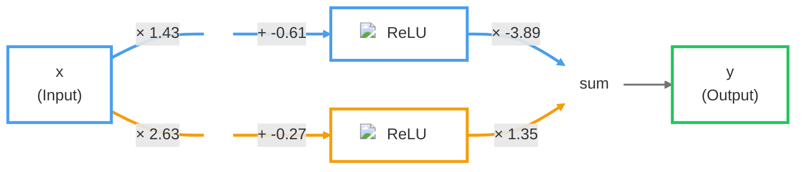

## Hierarchy of concepts

```
Artificial Intelligence
└── Machine Learning
    └── Deep Learning
        └── Neural Networks
            ├── CNNs (Computer Vision)
            ├── RNNs (Sequential data)
            └── Transformers
                 └── Large Language Models (GPT, Llama, Claude...)
```

## Training vs Inference

Training is the learning phase. The model processes a large dataset, makes predictions, measures its errors, and adjusts its weights until it learns the task.

Inference is the execution phase. The trained model keeps its weights fixed and uses them to make predictions on new inputs, such as answering a prompt or generating an image.

## Transformer architecture

One of the most commonly used architecture. Transofrmer neural networks are the architecture that allows LLMs to process sequences of data (like text) and capture relationships between tokens, regardless of their distance in the input sequence. The key components of a transformer include:

Prompt
    │
    ▼

Tokenizer
    │
    ▼

Token IDs
    │
    ▼

Embedding lookup
    │
    ▼

Positional encoding
    │
    ▼

Transformer blocks
       ├── Self-Attention
       ├── Feed Forward Network
       ├── Residual Connections
       └── Layer Normalization
    │
    ▼
Final contextual embeddings
    │
    ▼
Linear projection
    │
    ▼
Logits (one score per vocabulary token)
    │
    ▼
Softmax
    │
    ▼
Probability distribution
    │
    ▼
Sampling

(temperature, top-k, top-p...)
    │
    ▼
Next token
    │
    ▼
Append token to prompt
    │
    ▼

Repeat until <EOS>

## Step 1: Tokenization: The text is split into tokens

    ["What", " is", " the", " capital", " of", " France", "?"]
    The goal of tokenization is to build a vacabulary of a reasonable size for the model to process, while preserving meanings. It does it by processing the corpus.
    So we won't have all the possible words because taht would mean a too big voccabulary and we have a token being a single caractere because we would loose meaning.
    Bytes pair Encoding. Basilaly joins the most common pairs of letters (bytes). And we do it recusivelyly
    Tokenizer Bytes pair Encoding training:
    Example

    ```
        Corpus:
        cat
        cat
        car

        Start:
        c a t
        c a t
        c a r

        Count pairs:
        c a = 3
        a t = 2
        a r = 1

        Merge: c + a → "ca"

        ca t
        ca t
        ca r

        Count again:
        ca t = 2
        ca r = 1

        Merge: ca + t → "cat"

        Final vocabulary:
        c
        a
        t
        r
        ca
        cat

        Tokenization:
        cat → ["cat"]
        car → ["ca", "r"]

```
Once trained at inference time the tokenizer  is looking for the longest matching tokens in its vocabulary.
Tokenizer return token in form of intergers. 

## Step 2: Embeddings: Convert tokens into vectors
EMbeddings are vector (mathematical concept) that means somehting
How to represent this. 
`King - Man + Woman ≈ Queen`
Let’s pretend the two dimensions are:
* X = Royalty
* Y = Gender (0 = female, 1 = male)

The Vector would be: (Royalty, Gender)
So we could have:
Man = (0, 1)
Woman = (0, 0)
King = (1, 1)
Queen = (1, 0)

King(1,1) - Man(0,1) + Woman(0,0) = Queen(1,0) 

The embeding is ultimalty the representation of the words you type as input the LLMs will process.
The embeding vectors are updated by looking at the context (aka the words serounding the token). this allow the model to distinguish when a word has multiple meaning.
Embedding capture meaning they also map where those meaning map in relation to one another 

At inference, the embeding stage would give the same embedding for each token. regardless of context.
then the embeding would be updated in the subsequent layers of the transformer and turned into "contextual embeddings"

## Step 3: Positionnal encoding

Because transformer process all tokens in parallel it need to have a notion of position. Without this information two sentance with word order diference would be processed the same way.

After we get the intial embedding, we add the positional encoding to the embedding.
Basically the positional encoding is a vector that we will add to the embedding
Imagine position 1 is encoded [0.1, 0.4, -0.2]

```ts
[0.3, -0.2, 1.1](dog) + [0.1, 0.4, -0.2](postition index 1) = [0.4, 0.2, 0.9]
```

## Step 4: Transformer block: Self-Attention

<https://www.youtube.com/watch?v=eMlx5fFNoYc&t=615s>
*(single attention head)*

Self-attention lets each token gather information from the other tokens before updating its representation.

For example:

> The dog chased the cat

The meaning of **"chased"** depends on both **dog** (subject) and **cat** (object).

---

### Step 4.1 — Project each embedding

The initial embedding for each word is some high dimensional vector that only encodes the meaning and positino of that particular word with no context. Let's say each token starts as an embedding **E**.

| Token | E |
| ------- | ------------ |
| The | [0.2, 0.8] |
| dog | [0.9, 0.1] |
| chased | [0.5, 0.7] |
| the | [0.2, 0.8] |
| cat | [0.8, 0.2] |

The goal is to have a series of computations produce a new refined set of embeddings where for instance a nomn would ingeste the meaning of the corresponding adjective.

The model has learned three matrices:

- Q is the question a token asks
- K is the label a token wears
- V is what it hands over when it gets picked

for example with the word "chased":

- Q : who is doing the chasing, and who is being chased?
- K : "past-tense transitive verb"
- V : the act of chasing

THe entries of this metrics are parameters of the model so there are learned from data/

```
    WQ                WK                 WV
[ 0.6   0.2 ]     [ 0.7  -0.1 ]     [ 0.9   0.0 ]
[ 0.1   0.8 ]     [ 0.3   0.5 ]     [ 0.2   0.6 ]
```

After projection:

| Token | Q | K | V |
| ------- | ------------ | ------------ | ------------ |
| The | [0.20, 0.68] | [0.38, 0.38] | [0.34, 0.48] |
| dog | [0.55, 0.26] | [0.66,-0.04] | [0.83, 0.06] |
| chased | [0.37,0.66] | [0.56,0.30] | [0.59,0.42] |
| the | [0.20,0.68] | [0.38,0.38] | [0.34,0.48] |
| cat | [0.50,0.32] | [0.62,0.02] | [0.76,0.12] |

Every token now has a **Query**, **Key**, and **Value** vector.

---

### Step 4.2 — Compute attention scores

Each Query is compared with every Key using a dot product.

```
score(i,j) = Qi · Kj
```

Doing this for every token produces the score matrix. Each cell is the dot product of a Query (row) with a Key (column):

| Qᵢ ↓ / Kⱼ → | The (K₁) | dog (K₂) | chased (K₃) | the (K₄) | cat (K₅) |
| ------------ | ----: | ----: | --------: | ----: | ----: |
| **The (Q₁)** | Q₁·K₁ = 0.33 | Q₁·K₂ = 0.10 | Q₁·K₃ = 0.32 | Q₁·K₄ = 0.33 | Q₁·K₅ = 0.14 |
| **dog (Q₂)** | Q₂·K₁ = 0.31 | Q₂·K₂ = 0.35 | Q₂·K₃ = 0.39 | Q₂·K₄ = 0.31 | Q₂·K₅ = 0.35 |
| **chased (Q₃)** | Q₃·K₁ = 0.39 | Q₃·K₂ = 0.22 | Q₃·K₃ = 0.41 | Q₃·K₄ = 0.39 | Q₃·K₅ = 0.24 |
| **the (Q₄)** | Q₄·K₁ = 0.33 | Q₄·K₂ = 0.10 | Q₄·K₃ = 0.32 | Q₄·K₄ = 0.33 | Q₄·K₅ = 0.14 |
| **cat (Q₅)** | Q₅·K₁ = 0.31 | Q₅·K₂ = 0.32 | Q₅·K₃ = 0.38 | Q₅·K₄ = 0.31 | Q₅·K₅ = 0.32 |

Large scores indicate stronger relevance.

---

### Step 4.3 — Normalize with Softmax

Softmax converts the raw scores into probabilities.

For **"chased"**:

```text
[0.39, 0.22, 0.41, 0.39, 0.24]
        ↓
[0.21, 0.18, 0.22, 0.21, 0.18]
```

A real transformer often produces much sharper distributions after training. To make the intuition clearer, we'll use this simplified attention pattern:

| Updating ↓ | The | dog | chased | the | cat |
| ------------ | ----: | ----: | --------: | ----: | ----: |
| **The** | 0.80 | 0.20 | 0.00 | 0.00 | 0.00 |
| **dog** | 0.10 | 0.70 | 0.20 | 0.00 | 0.00 |
| **chased** | 0.02 | 0.45 | 0.06 | 0.02 | 0.45 |
| **the** | 0.00 | 0.00 | 0.00 | 0.80 | 0.20 |
| **cat** | 0.00 | 0.10 | 0.20 | 0.10 | 0.60 |

Each row answers:

> **How much should this token use every other token?**

---

### Step 4.4 — Update the embedding

Updating the embedding we use the value vector that we multiply to the embedding of
A value vector (V) in the attention mechanism is the actual numerical content or semantic representation of a token that gets combined and passed forward once relevance is established.

The attention weights are applied to the **Value vectors computed in Step 1**.

For **"chased"**:

| Token | Weight | Value |
| ------- | ------: | ------------- |
| The | 0.02 | [0.34,0.48] |
| dog | 0.45 | [0.83,0.06] |
| chased | 0.06 | [0.59,0.42] |
| the | 0.02 | [0.34,0.48] |
| cat | 0.45 | [0.76,0.12] |

The new embedding becomes:

```text
new(chased) =

0.02 × [0.34,0.48] +
0.45 × [0.83,0.06] +
0.06 × [0.59,0.42] +
0.02 × [0.34,0.48] +
0.45 × [0.76,0.12]
```

```text
= [0.76, 0.12]
```

The embedding for **"chased"** now contains information from **dog** and **cat**, because those tokens received the highest attention.

### Step 5 — Feed Forward Network (FFN / MLP)

<https://www.youtube.com/watch?v=3ZDSdMpczXE>

<https://www.youtube.com/watch?v=aircAruvnKk&t=43s>
Self-attention only **mixes** information between tokens: every output is a weighted sum (linear combination) of Value vectors. Stacking linear operations still gives you a linear operation, so on its own attention can't learn complex patterns like "if X and Y then Z". The FFN is where each token, independently, gets pushed through a **non-linear** transformation so the model can actually learn richer functions.

Unlike attention, the FFN has **no interaction between tokens** — the same two matrices are applied to every token's embedding, one token at a time.

### FFN

Let's take a neural network for image recognition.

A node is a neuron.

The first layer is the input layer.
The last layer is the output layer.
Everything in between is a hidden layer.

If we want image recognition that deduces whether an image contains a digit:
the output layer could be the 10 digits we want (0-9).
The input layer could be each pixel, with a value between 0 and 1 depending on how "grey" it is.

We can imagine that each hidden layer decomposes the digit. In the layer just before the output, each neuron could already represent part of the digit — like a loop or a hook (for a nine). The combination of the activations of "loop" and "hook" would then activate the "9" output neuron. The layer just before that could represent sub-parts of that loop and hook.

Each connection is assigned a weight (during training). Weights are just numbers.

To know whether a neuron in the second layer activates, we take the weighted sum of the activations of the previous layer — each activation multiplied by the weight of its connection — then add a bias and pass the result through a non-linear activation function (sigmoid, ReLU, GELU, …). That output is the neuron's activation.



Along each path the input is first multiplied by a weight (`×`), then the neuron's bias is added (`+`), and the result goes through ReLU — that is the bend you see in the little graphs. The two bent curves are then scaled again and summed:

```text
h₁ = relu(1.43·x + -0.61)
h₂ = relu(2.63·x + -0.27)
y  = -3.89·h₁ + 1.35·h₂
```

Same shape as the general formula below — the numbers are just what training happened to land on.

The bias tells how high the weighted sum needs to be before the neuron starts to activate.

Each input neuron is connected to every second-layer neuron. Every **connection** has its own weight; every **neuron** has its own bias.

So for a neuron `j` in the second layer, with `a₁ … aₙ` the activations of the input layer:

```text
aⱼ = relu(w₁ⱼ·a₁ + w₂ⱼ·a₂ + … + wₙⱼ·aₙ + bⱼ)
```

`relu` is the activation function:

```text
relu(z) = max(0, z)
```

Negative weighted sum → output 0, the neuron stays silent. Positive → the value passes through unchanged, so "how strongly is this feature present" is unbounded above. Unlike sigmoid, ReLU doesn't saturate, so gradients keep flowing in deep networks — which is why transformers use it (or its smoother cousin GELU) in the FFN.

For the whole layer at once, the same thing written with matrices — one row of `W` per neuron, one entry of `b` per neuron:

```text
a⁽¹⁾ = relu(W·a⁽⁰⁾ + b)
```

With 784 input pixels (28×28) and 16 neurons in the second layer, `W` is a 16×784 matrix and `b` a vector of 16 — that is 12 544 weights and 16 biases, all learned during training.

These weight and bias are gnobs that the neuronal network can tweek its behavior. Learning is finding the right weight and biases
A neural network is essencially a function. That take 784 input, outupt 10 number and has 13000 parametes (weights and biases)

<https://www.youtube.com/watch?v=IHZwWFHWa-w>

In training mode all weight and bias are randomly picked.
To calculate the training cost we compute the square of the difference between the resujlt and the expected one. If the rusult say 6 mening that the neurone with 6 has highest value. ti would mean;
We approximate cost by doing the average of all cost of all training example.
Cost function is another function
Input: 13000 parametes (weight and biases)
Output: 1 number (how bad the parametes are)
Parameters: training example
